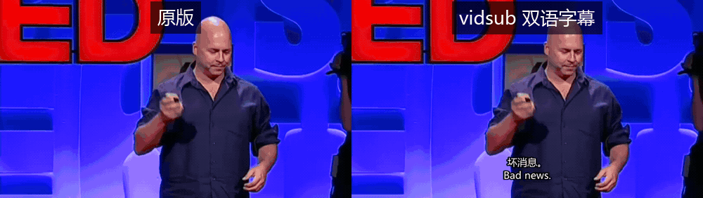
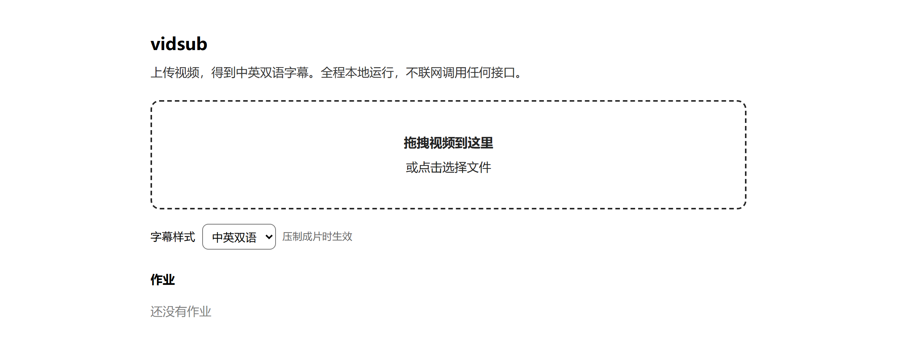
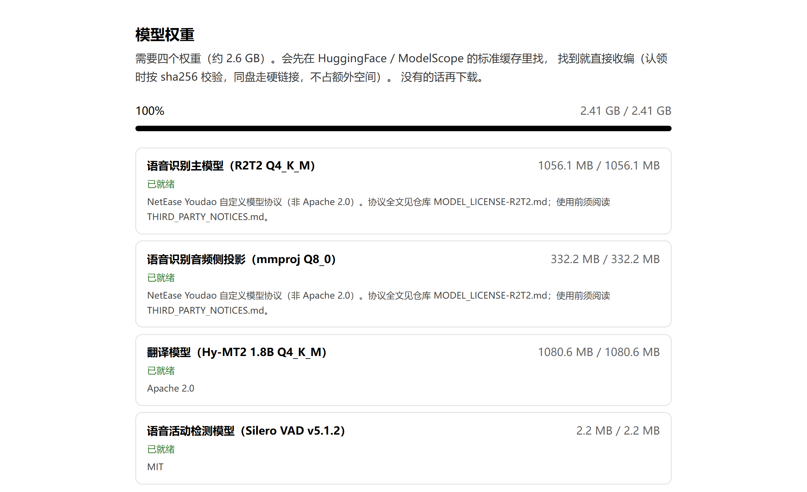

# vidsub

本地运行的双语字幕工具：上传视频，得到烧录好中英双语字幕的成片

不用 GPU，不联网调用任何 API，不上传你的视频。识别、翻译、压制全部在本机完成，
模型只在你第一次打开页面时下载。



*左边是原视频，右边是 vidsub 压好的成片 —— 中文在上、英文在下。素材是项目测试用
的 TED 演讲片段（226 秒），实测约 1.5 分钟跑完。*

---

## 目录

- [使用前必读：模型许可](#使用前必读模型许可)
- [它是什么](#它是什么)
- [安装](#安装)
- [使用](#使用)
- [模型权重](#模型权重)
- [常见问题](#常见问题)
- [维护者](#维护者)
- [致谢](#致谢)
- [贡献](#贡献)
- [许可](#许可)

---

## 使用前必读：模型许可

**本项目源代码是 MIT 许可，但它依赖的识别模型不是开源许可。**

| 组件 | 许可 | 可否商用 |
|---|---|---|
| **Confucius4-R2T2**（识别） | **网易自定义模型使用协议** ⚠️ | **有条件**，见下 |
| Hy-MT2-1.8B（翻译） | Apache 2.0 | ✅ |
| Silero VAD v5.1.2 | MIT | ✅ |
| llama.cpp | MIT | ✅ |

识别模型使用的**不是** Apache 2.0，而是一份自定义协议。关键三条：

1. **商业授权门槛**（第 2.2 条）：月活超 1 亿或上年营收超人民币 10 亿，须向网易
   另行申请商业授权。个人自用与本地研究不受此限。
2. **禁止用于改进其他 AI 模型**（第 3.4c 条）：不允许用本项目的识别输出去训练或
   微调其他商业 AI 模型。
3. **须保留协议全文**（第 3.4b 条）：因此权重不打包进 wheel、不进 Git LFS，首次
   运行时下载，并随权重落盘一份协议副本。

完整条款见 [`THIRD_PARTY_NOTICES.md`](THIRD_PARTY_NOTICES.md) 与
[`MODEL_LICENSE-R2T2.md`](MODEL_LICENSE-R2T2.md)（协议全文逐字副本）。

**本节不是法律意见。** 商业分发或大规模部署前请自行确认授权状态。

## 它是什么

把一段视频做成双语字幕，通常要么上传到云端服务，要么自己拼 ffmpeg + Whisper +
某个翻译 API。前者要求你把视频交出去，后者要求你有 API key，两者都要联网。

vidsub 是第三种：**一个跑在自己机器上的网页**。拖一个视频进去，等它跑完，拿到
一份中文在上、英文在下的 SRT，以及一份字幕烧进画面的成片。没有账号，没有额度，
没有"这个文件会上传到我们的服务器"。

需要一台像样的 CPU 和大约 2.4 GB 磁盘（模型权重）。不需要显卡。

## 安装

需要 **Python 3.10+** 和 **ffmpeg**。

```bash
pip install -e .
```

### 依赖

| 依赖 | 用途 | 怎么装 |
|---|---|---|
| **Python 3.10+** | 运行时 | [python.org](https://www.python.org/downloads/) |
| **ffmpeg / ffprobe** | 抽音轨、探测媒体、烧录字幕 | Windows：`winget install Gyan.FFmpeg`；macOS：`brew install ffmpeg`；Linux：`apt install ffmpeg` |
| llama-server | 本地推理 | 不用单独装 —— 首次运行时会自动下载对应平台的预编译包 |

ffmpeg 必须在 `PATH` 里。自定义路径用 `VIDSUB_FFMPEG` / `VIDSUB_FFPROBE` 指定。

## 使用

```bash
python -m vidsub
```

浏览器会自动打开 `http://127.0.0.1:<端口>/`，端口自动挑空闲的。

第一次打开会看到模型下载页（四个文件，约 2.4 GB），见 [模型权重](#模型权重)。
权重齐了之后首页就是上传区：拖一个视频进去，页面会显示时长、分辨率、体积，
提交后进入处理状态，跑完直接能看到中英对照的字幕。



### 命令行

```bash
python -m vidsub                 # 自动挑端口，自动开浏览器
python -m vidsub --port 8848     # 指定端口
```

重复执行**不会启动第二个实例** —— 探测到已有实例时会直接在浏览器里打开它就退出。

服务只监听 `127.0.0.1`，不对局域网暴露。

### 字幕样式

页面上可以选两档，**压制成片时生效**：

| 样式 | 效果 |
|---|---|
| 中英双语（默认） | 中文在上、英文在下，底部居中带描边 |
| 纯中文 | 只留中文行 |

字幕条数多时会自动分段，避免一整条长句盖掉半个画面。成片压制完可以在页面里
直接播放，也能单独下载成片或 SRT。

### 产物落在哪

- **页面上下载**是最直接的方式（成片 / SRT 都有下载链接）。
- 磁盘上的位置是 `<VIDSUB_DATA_DIR>/jobs/<作业 id>/`，默认 `VIDSUB_DATA_DIR`
  是 `~/.vidsub`。
- 中间品（切段音频、临时目录）用完即清，但**成片和 SRT 不会自动删除** ——
  什么时候清理由你决定。

### 处理要多久

实测：**226 秒的视频约 1.5 分钟出字幕**（含首次加载模型），大致比实时快一倍多。
压制成片另算，通常比识别快。

第一次运行还要额外等模型下载（取决于网速）。之后模型常驻内存，连续处理多条不会
重复加载。

## 模型权重

第一次打开页面会看到权重清单（四个文件，合计 2,591,149,252 字节 ≈ 2.4 GB）。
它会**先查本机已有的副本**，找不到才下载：

| 来源 | 默认位置 | 目录形态 |
|---|---|---|
| HuggingFace | `~/.cache/huggingface/hub` | `models--<org>--<repo>/snapshots/<版本>/<文件>` |
| ModelScope 1.37 | `~/.cache/modelscope/hub` | `<org>/<repo>/<文件>` |
| ModelScope 旧版 | 同上 | `models--<org>--<repo>/...` |

认领按 **sha256 + 体积**判定，文件名和层级都不要求；同盘走硬链接，不占额外空间。
你也可以在下载页手动指定一个目录，把里面已有的权重认领进来。

都找不到时，页面会给出每个权重在 ModelScope 上的**直链与可续传命令**
（`curl -L -C -`）。只给单个文件是有意的：GGUF 仓库里还躺着 Q8_0 / f16 等其它
量化，整个仓库下会多花好几倍磁盘和时间，而你只需要其中一个。



### 网络与代理

默认**直连**下载。ModelScope 直连通常比走代理快得多，所以别给它挂代理；但
**GitHub 例外** —— VAD 模型在 GitHub 上，直连容易中途截断，所以自动走代理。

直连遇到网络层错误会自动回退代理一次，并记住该域名，不再重复卡超时。

| 变量 | 作用 |
|---|---|
| `VIDSUB_DOWNLOAD_PROXY` | 代理地址，如 `http://127.0.0.1:7897` |
| `VIDSUB_FORCE_DIRECT=0` | 全部走代理（墙内网络） |
| `VIDSUB_PROXY_HOSTS` | 追加需要走代理的域名，逗号分隔 |
| `VIDSUB_DOWNLOAD_TIMEOUT` | 单次请求超时秒数，默认 60 |

### 环境变量

| 变量 | 作用 |
|---|---|
| `VIDSUB_DATA_DIR` | 权重与作业的落盘目录，默认 `~/.vidsub` |
| `VIDSUB_NO_BROWSER=1` | 启动时不打开浏览器 |
| `VIDSUB_LLAMA_SERVER` | 自定义 llama-server 可执行文件路径 |
| `VIDSUB_IDLE_TIMEOUT` | 空闲多久回收常驻模型，默认 1800 秒；`0` 表示不回收 |
| `VIDSUB_SSE_MAX_SECONDS` | 进度推送最长时长，默认 43200 秒（12 小时） |
| `VIDSUB_VAD_MODEL` | 自定义 VAD 模型路径 |

关于 `VIDSUB_DATA_DIR` 的两条建议：

- 放在权重所在**同一个卷**上，这样认领走硬链接而不是复制 2.4 GB。
- **路径不能含空格** —— 含空格的绝对路径会让 llama-server 拒绝启动。

## 常见问题

**处理到一半失败了，怎么看原因？**
页面上那条作业会显示可读的失败原因（不带 traceback）。完整的服务端日志在
`<VIDSUB_DATA_DIR>` 下，推理服务自己的日志也在那里。

**能不能不重新下载，用我已经有的权重？**
能。下载页有"扫描本机缓存"按钮（去 HuggingFace / ModelScope 标准位置找），也可以
手动指一个目录让它按 sha256 认领。两种方式都不会重新下载。

**模型能一直占着内存吗？**
默认空闲 30 分钟回收。想让它常驻就设 `VIDSUB_IDLE_TIMEOUT=0`。

**为什么不用 GPU？**
目标场景是"手边这台机器就能跑"，不假设有独显。CPU 上 226 秒素材约 1.5 分钟，
够用。

**支持哪些格式？**
常见容器都行（mp4 / mkv / webm / mov 等）。**必须带音轨** —— 没有音轨的文件在
上传阶段就会被拒（422），不会让你等到跑完才发现。

**视频会被上传到哪儿吗？**
不会。服务只监听 `127.0.0.1`，除了首次下载模型权重之外没有任何外部请求。

## 维护者

[@deepsleepzzz0211](https://github.com/deepsleepzzz0211)

## 致谢

- [llama.cpp](https://github.com/ggml-org/llama.cpp) —— 本地推理的底座
- [Confucius4-R2T2](https://www.modelscope.cn/) —— 语音识别模型（网易）
- [Hy-MT2](https://www.modelscope.cn/) —— 翻译模型
- [Silero VAD](https://github.com/snakers4/silero-vad) —— 语音活动检测

## 贡献

欢迎开 issue 讨论，也接受 PR。

提问或报 bug 请到 [Issues](https://github.com/deepsleepzzz0211/vidsub-webui/issues)。
报 bug 时如果能附上：操作系统、Python 版本、视频的时长与编码、页面上显示的失败
原因 —— 会快很多。

要改代码的话，开发环境、测试怎么跑、以及代码里那些看起来奇怪的设计为什么必须
那样，都写在 [`CONTRIBUTING.md`](CONTRIBUTING.md) 里了。**动相关代码前建议先读
一遍** —— 里面几条约束各自对应一个曾经发生过的、症状很隐蔽的故障。

## 许可

源代码 [MIT](LICENSE)。

**模型权重不是 MIT** —— 识别模型使用网易自定义协议，商业使用有条件限制。详见
[使用前必读](#使用前必读模型许可) 与 [`MODEL_LICENSE-R2T2.md`](MODEL_LICENSE-R2T2.md)。
